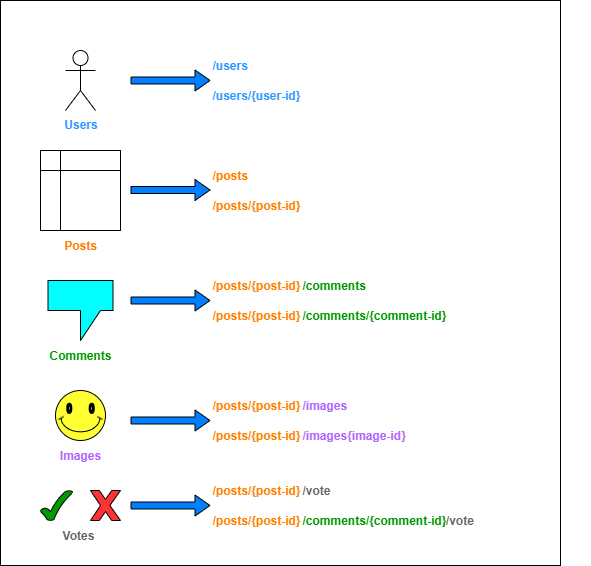

# **Shitposter** - Reddit-like forum pet project
The goal is to learn and demonstrate web dev skills.

## Functional Requirements
1. A user must **signup** and **login** to post, vote or comment.
2. A user should be able to create a **new post** that contains a
   - Title
   - Topic tags
   - Body (text or uploaded images)
3. A user should be able to **comment** on any existing post.
4. **Comments** are ordered **by popularity** as a **tree**.
5. User can **delete** their own **post** or **comment**.
6. **Logged-in** user can **upvote/downvote** an existing **post/comment**.
7. Present the top **most popular posts** in the **last 24 hours** on the homepage.
   > **Popularity** = **Upvotes** - **Downvotes**

## Non-Functional Requirements
1. **Scalability** (millions of daily users) (actually, it should be just as scalable as pet project can be, since it is just a Reddit clone)
2. **Performance** (less than 500 ms Response Time 99p)
3. **Fault Tolerance/High Availability** (99.9%)
4. **Availability + Partition Tolerance** (<ins>AP</ins> over CP) (not relevant for now since every service db will have only one instance)
5. **Durability**

## Api definition
***REST*** API over HTTP

1. Identifying the different entities
   - Users
   - Posts
   - Images
   - Comments
   - Votes
2. Mapping Entities to URIs</br>

3. Resource representation
   - User (public)
      ```json
      {
        "id": 1,
        "display_name": "user1",
        "profile_img_url": "localhost:4000/media/images/iamge1",
        "created_at": "2025-07-21 15:11:55.039123+00"
      }
      ```
   - User (private)
      ```json
      {
        "id": 1,
        "username": "user1",
        "display_name": "user1",
        "is_deleted": false,
        "email": "user@mail.com",
        "profile_img_url": "localhost:4000/media/images/iamge1",
        "created_at": "2025-07-21 15:11:55.039123+00"
      }
      ```
   - Single Post</br>
      **GET** /posts{post-id}
      ```json
      {
        "id": 1,
        "title": "Post Title",
        "user_id": 1,
        "topics": ["stock", "trading"],
        "upvotes": 50,
        "downvotes": 1,
        "body": "...", // <-- body can be JSON encoded markdown since it can contain both text and images.
        "created_at": "2025-07-21 15:11:55.039123+00",
        "last_modified_at": "0001-01-01 00:00:00+00"
      }
      ```
   - Single Comment</br>
      **GET** /posts/{post-id}/comments/{comment-id}
      ```json
      {
        "id": 1,
        "user_id": 1,
        "post_id": 1,
        "parent_id": 1,
        "upvotes": 50,
        "downvotes": 1,
        "body": "I agree",
        "created_at": "2025-07-21 15:11:55.039123+00",
        "last_modified_at": "0001-01-01 00:00:00+00",
        "is_deleted": false,
        "deleted_at": "0001-01-01 00:00:00+00",
        "replies": [
          "..." // <- comment can contain other comments as its replies since
        ]
      }
      ```
   - Comments Collection</br>
      **GET** /posts/{post-id}/comments
      ```json
      {
        "post_id": 1,
        "comments": [
          {
            "id": 1,
            "user_id": 1,
            "post_id": 1,
            "parent_id": 1,
            "upvotes": 50,
            "downvotes": 1,
            "body": "I agree",
            "created_at": "2025-07-21 15:11:55.039123+00",
            "last_modified_at": "0001-01-01 00:00:00+00",
            "is_deleted": false,
            "deleted_at": "0001-01-01 00:00:00+00",
            "replies": [
              "..." 
            ]
          }
        ]
      }
      ```
   - Single Vote</br>
      **GET** /posts/{post-id}/vote</br>
      **GET** /posts/{post-id}/comments/{comment-id}/vote
      ```json
      {
         "id": 1,
         "user_id": 1,
         "entity": "post", // or "comment"
         "entity_id": 1,
         "vote": 1, // 1 for upvote, -1 for downvote
         "created_at": "2025-07-21 15:11:55.039123+00",
         "last_modified_at": "0001-01-01 00:00:00+00"
      }
      ```
4. Assigning methods to operations on Resources
   - Users
      - **POST** /users/signup/start → Start Webauthn registration process
      - **POST** /users/signup/finish → Finish Webauthn registration process
      - **POST** /users/signin/start → Start Webauthn login process
      - **POST** /users/signin/finish → Finish Webauthn login process
      - **GET** /users/{user-id} → Get user's data
      - **PATCH** /users → Update user's data
      - **POST** /users/renew_access → Renew access token via refresh token
      - **DELETE** /users → Delete user
   - Posts
      - **POST** /posts → Create new Post
      - **GET** /posts → View posts
      - **GET** /posts?limit=20&offset=0 → View posts with pagination
      - **GET** /posts/{post-id} → View specific post
      - **PATCH** /posts/{post-id} → Edit specific post
      - **DELETE** /posts/{post-id} → Delete post
   - Comments
      - **POST** /posts/{post-id}/comments → Create new Comment
      - **POST** /posts/{post-id}/comments/{comment-id} → Reply to a Comment
      - **PATCH** /posts/{post-id}/comments/{comment-id} → Edit a Comment
      - **GET** /posts/{post-id}/comments → View comments
      - **GET** /posts/{post-id}/comments?limit=20&offset=0 → View comments with pagination
      - **GET** /posts/{post-id}/comments?order_by=popularity&limit=20&offset=0 → View most popular comments with pagination
      - **DELETE** /posts/{post-id}/comments/{comment-id} → Delete comment
   - Votes
      - **POST** /posts/{post-id}/vote → Vote/Downvote a Post
      - **POST** /posts/{post-id}/comments/{comment-id}/vote → Vote/Downvote a Comment
      - **DELETE** /posts/{post-id}/vote → Delete post vote
      - **DELETE** /posts/{post-id}/comments/{comment-id}vote → Delete comment vote
   - Images
      - **POST** /media/images → Save an image
      - **GET** /media/images/{image-id} → Get an image